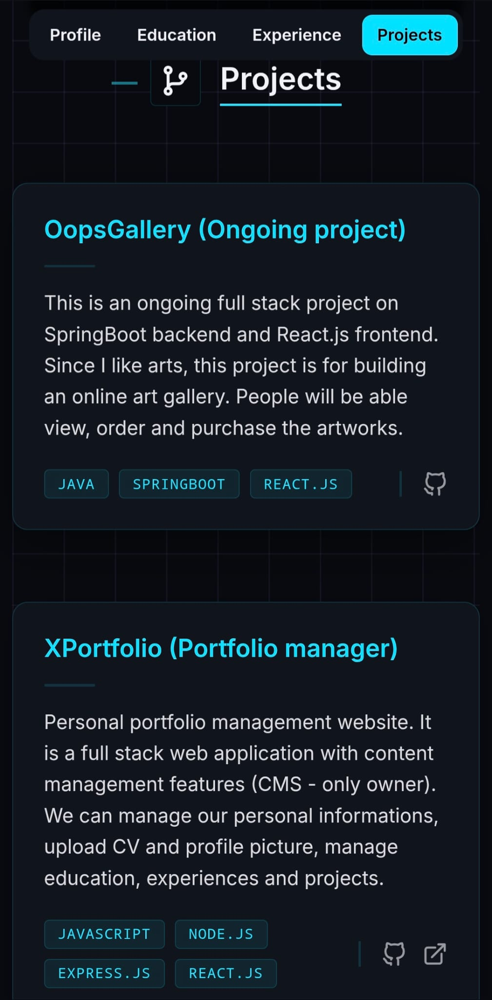
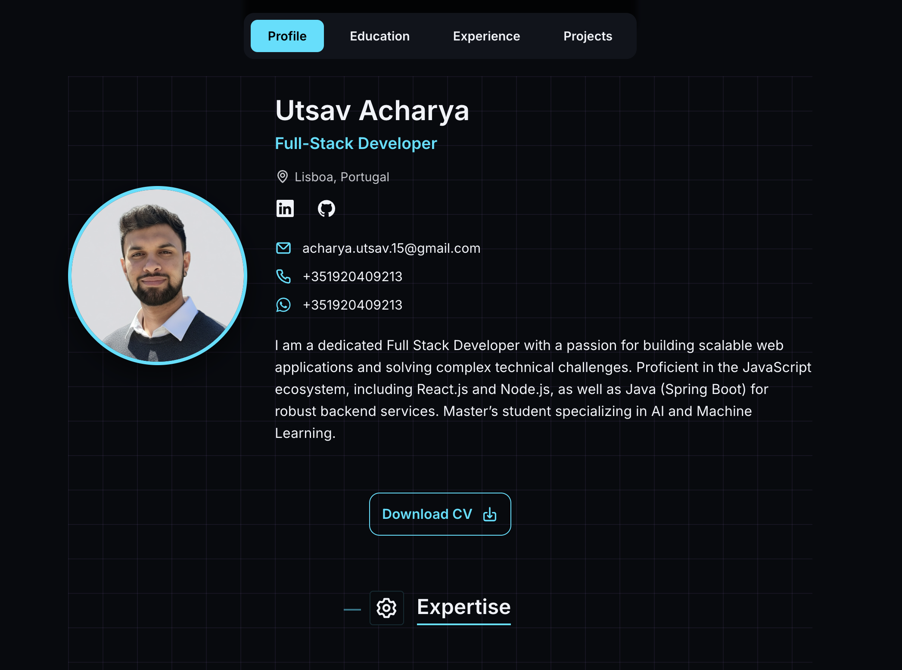
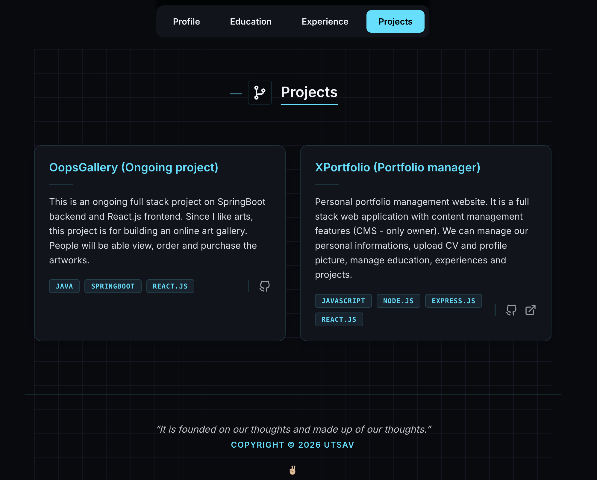
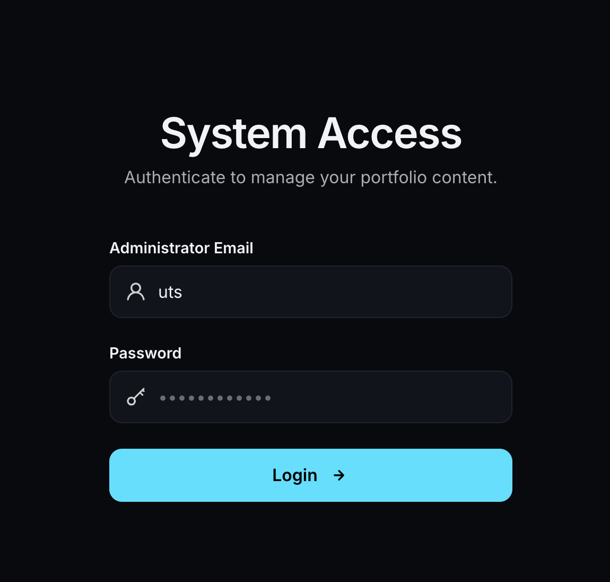
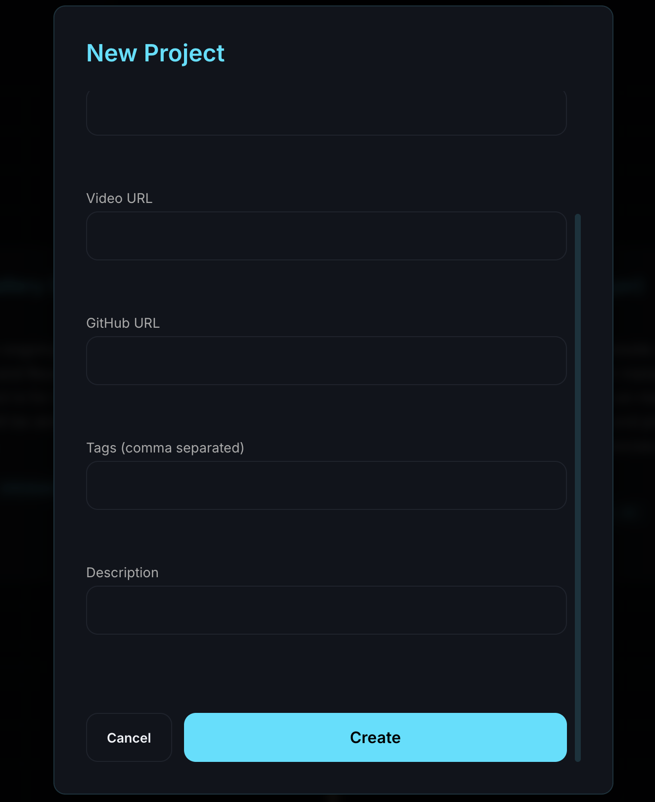

# Personal Portfolio Management Website

## Concept

A **full-stack personal portfolio management website** with **Content Management System (CMS)** features (owner-only access).

This application allows the owner to:

- Manage personal information
- Upload CV and profile picture
- Manage education, work experience, skills, and projects

---

## Backend

### Stack Used

- **Node.js**
- **Express (REST APIs)**
- **PostgreSQL**
- **Supabase** (Database + Storage)
- **JWT Authentication**

### Architecture

- **Repository Pattern**

---

### Backend Environment Variables (`.env`)

Create a `.env` file inside the **backend** folder.

```env
# CMS authentication
CMS_USERNAME=<username>
CMS_PASSWORD=<password>

# JWT configuration
JWT_SECRET=<jwt-secret-key>
JWT_EXPIRES_IN=<jwt-token-expiration-time>   # e.g. 1d, 1y

# Server configuration
NODE_ENV=development
PORT=8080

# Database
DATABASE_URL=<database-url>

# Supabase storage
SUPABASE_URL=<supabase-url>
SUPABASE_SERVICE_ROLE_KEY=<supabase-role-key>
SUPABASE_STORAGE_BUCKET=<bucket-name>
```

---

## API Endpoints

### Public Routes

```
GET    /courses               ## Get all courses
GET    /courses/{id}          ## Get a course by ID

GET    /education             ## Get all education entries
GET    /education/{id}        ## Get an education entry by ID

GET    /work-experience       ## Get all work experiences
GET    /work-experience/{id}  ## Get a work experience by ID

GET    /projects              ## Get all projects
GET    /projects/{id}         ## Get a project by ID

GET    /skills                ## Get all skills
GET    /skills/{id}           ## Get a skill by ID

GET    /profile               ## Get profile information
```

---

### Protected / CMS Routes

```
POST   /auth/login            ## Login (get JWT token)

POST   /courses               ## Create a course
PUT    /courses/{id}          ## Update a course
DELETE /courses/{id}          ## Delete a course

POST   /education             ## Create an education entry
PUT    /education/{id}        ## Update an education entry
DELETE /education/{id}        ## Delete an education entry

POST   /work-experience       ## Create a work experience
PUT    /work-experience/{id}  ## Update a work experience
DELETE /work-experience/{id}  ## Delete a work experience

POST   /projects               ## Create a project
PUT    /projects/{id}          ## Update a project
DELETE /projects/{id}          ## Delete a project

POST   /skills                 ## Create a skill
PUT    /skills/{id}            ## Update a skill
DELETE /skills/{id}            ## Delete a skill

PUT    /profile                ## Update profile information
```

---

## Frontend

### Stack Used

- **React.js**
- **CSS**
- **Styled Components**

---

### Frontend Environment Variables (`.env`)

```env
REACT_APP_API_URL=<backend-api-url>
```

---

## Live View

🔗 **Visit the website:**
[https://oopsaav.netlify.app/main](https://oopsaav.netlify.app/main)

### Available Views

- **Public View** – What visitors normally see
- **CMS View** – Owner-only view for content management

### Features

- Fully responsive (large, medium, and small screens)
- Easy theme customization using global variables

---

## Public View

### Small Screens




---

### Large Screens





---

## CMS View




---

## Thank You!

If you like this project or find it useful, feel free to ⭐ the repository.
